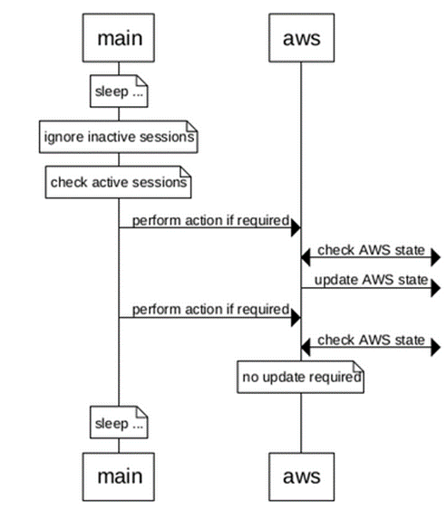

# HA App Design

The functional specification for the full HA container solution for XRd vRouter is available in [functional_spec.md](functional_spec.md), which the reader is expected to be familiar with.

This document covers the design of the HA container application and associated Helm chart.

## Problem Definition

The full problem definition is given in [Functional Specification: Problem Definition](functional_spec.md#problem-definition).
This can be summarized in the context of the HA app as follows.

Due to limitations in networking of cloud providers such as AWS, a custom solution is required to support HA for XR running in these environments.
The chosen solution comes in the cloud-native form of using a 'microservice' container, the 'HA app'.

The job of this app is to receive notifications from XR when a failover event occurs, and to reconfigure the cloud environment to suitably reroute traffic.
This is achieved by registering to receive telemetry notifications for VRRP state updates.
The actions which can be taken depend on the use-case.
In one case the AWS VIP is reassigned when there is a change to the active interface for a configured VRRP session; in another case a route table is reconfigured.

The solution provided is specifically focusing on supporting AWS, however it may be extended in future to support other cloud providers or reconfiguration actions.

The HA app will be provided as an open source project, although ongoing maintenance/enhancements are expected to be minimal.
This serves as an example for how this kind of thing can be done (writing a standalone app that interacts with XR and cloud configuration to work around networking limitations, and building/running the corresponding container).

To simplify deployment, a Helm chart is provided which encapsulates the HA app and its associated XRd vRouter instance as a single release.

## Design Considerations

This section covers considerations for the design, including the main goals for the app, factors influencing implementation choices, error handling, and container best-practices to adhere to.

### Primary Design Goals

Within the bounds of satisfying the requirements, one of the primary goals is to keep the app simple and accessible, given the intention for the source code to serve as an example for users to read/fork as necessary.
Standard solutions and best-practices for writing a containerized app should be employed.

Performance is also relevant, particularly in the critical path of reacting to a failover event, to minimize packet loss.
Startup performance is less critical, although still of some relevance given a container restart (e.g. upgrade) should cause minimal outage.
See [Functional Specification: Scale and Performance](functional_spec.md#scale-and-performance) for details on the performance requirements.

Some effort should be made to modularize the code to enable supporting further cloud providers or reconfiguration actions in future.
However, this should not be sought out to the detriment of code simplicity - overengineering should be avoided, with code clarity being an important factor.

### Choice of Implementation Language and Base Container Image

The app is implemented in Python for ease of implementation, maintainability and accessibility for the target audience.

Using the Go language would be an alternative option, perhaps commonly chosen when using gRPC and GPB as well as being popular in world of container software, however 
Python is deemed the practical choice for the initial implementation.
In the future, if there is a desire to switch to using gNMI, then reimplementing in Go may be worth considering (e.g. to make use of Go libraries that simplify gNMI interaction).

Python is a popular choice for implementing container apps, and there is a wealth of third party libraries available for use.
This allows the complexity of the code in the HA app itself to be reduced, instead relying on third party libraries to do the heavy lifting.
Of particular relevance to the HA app, there are popular, well-maintained libraries for gRPC ([grpcio](https://grpc.io/docs/languages/python/)), AWS interaction ([boto3](https://boto3.amazonaws.com/v1/documentation/api/latest/index.html)), and performing HTTP requests ([requests](https://requests.readthedocs.io/)).

There is a range of Docker-official base container images provided for Python (<https://hub.docker.com/_/python>).
This provides the option to use a recent version of Python, to select a 'slim' image (avoiding unnecessary packages, reducing security risk), as well as the essential aspect of using a maintained, hardened base image.
For the initial release the `python:3.11-slim-bullseye` image is chosen, using a recent but widely supported version of Python in 3.11, and being based on the most recent stable Debian version ('Bullseye' being the codename for Debian 11).

### Security

The subsections below cover:
* AWS authentication
* Use of TLS
* Container best-practices

#### AWS Authentication

The HA application makes API requests to AWS services using IAM permissions, and must sign these requests with AWS credentials.

This is managed by using IAM roles for service accounts (IRSA).
An IAM role is associated with a Kubernetes service account, and the HA application Pod is configured to use this service account.
This has several benefits and is considered best practice:
* Least privilege - IAM permissions are scoped to the HA application, rather than the HA application assuming an IAM role attached to the worker node EC2 instance.
* Credential isolation - the HA application can only retrieve credentials for the IAM role that it is associated with, and does not have access to credentials used by containers in other Pods.
* Auditability - access and event logging is available through AWS CloudTrail.
* Simplicity - kubelet automatically rotates the token after 24 hours, and the AWS SDK is responsible for reloading the token when it rotates.
  There is therefore no need for any such handling in the HA application itself.

#### TLS Between HA App and XRd

There is no requirement for the HA app to support TLS on the gRPC server that listens for XR telemetry notifications, and XR telemetry config should use the 'no-tls' flag.

In a cloud environment it is impractical to expect each individual application ('microservice') to implement TLS support for communication within the cluster (between pods).
The cloud native solution is to use a Kubernetes 'Service Mesh' for encrypting and restricting internal network traffic.
With this approach there is no need for individual container applications to be concerned with encryption - it is managed at a higher level of abstraction.

Deployment considerations around using a Service Mesh or Kubernetes Network Policies are outside the scope of this document.

#### Container Security Best-Practices

General best-practices for containers are discussed in [Container Best-Practices](#container-best-practices) below.
The key security points to call out are:
* Use a slim base image to reduce attack surface area.
* Run as non-root user.
* Run with minimal capabilities.
* Run a container image security scanner, as per [Functional Specification: Vulnerability Testing](functional_spec.md#vulnerability-testing).

### Error Handling and Debuggability

#### High Availability and Restartability

High availability of the HA app itself is managed by Kubernetes, by setting the restart policy for the pod to "always".
This means that if the app unexpectedly exits it will be restarted automatically by Kubernetes (using an exponential backoff in the case of multiple restarts).

#### Debugging

The primary mechanism for debugging the HA solution is to check the HA container logs.
The console logs available via `kubectl logs` should include sufficient information to understand the state of the container and diagnose any potential problems.
Details on the end-user interface are given in [Functional Specification: End User Interface/User Experience](functional_spec.md#end-user-interfaceuser-experience).

If the app exits unexpectedly then the exception traceback is included in the logs, and the `--previous` flag to `kubectl logs` may be used to include console logs from previous container boots, prior to the restart that should be automated by Kubernetes.
In addition, `kubectl describe pod` can be used to get further details about any container restarts.

Given console logs are retained and managed by Kubernetes, the volume of logging must not be too high to avoid excessive disk usage.

#### HA App Error Handling

Errors internal to the HA app are classified and treated as follows:
* Error during initialization:
  * Log an error with suggested remedial action.
  * Exit with exit code 2.
* External error when performing an action:
  * Log an error for each failure.
  * Keep running.
* Unexpected error:
  * Log exception traceback.
  * Exit with exit code 1 (to be restarted by Kubernetes).

#### Double-Active Error Case

There is a theoretical error case where both HA apps try to react to an 'active' notification at the same time.
There is no special handling for this case - it is expected that whichever HA app gets triggered last will manifest the effect of the registered go-active event.

To rectify the case where the wrong instance ends up configured as active, the HA app implements a periodic check for whether actions need to be retriggered to bring its paired XRd instance back to active.
This relies on accurate tracking of active states, which can be achieved by moving to 'inactive' when the connection between the HA container and XR gets dropped.

See the [Timer Intervals](#timer-intervals) section for details on how this is handled.

### Container Best-Practices

The following container best-practices are to be adhered to:
* Container build
  * Optimise for caching by putting often-changing build steps towards the end of the Dockerfile and slower steps towards the beginning.
  * Configure app to run as a non-root user (see <https://pythonspeed.com/articles/root-capabilities-docker-security/>).
* Choice of base image
  * This is discussed in Choice of Implementation Language and Base Container Image.
  * There are suggestions not to use an Alpine container image for a Python application, e.g. <https://pythonspeed.com/articles/alpine-docker-python/>.
  * Use a fixed-version official image that receives security updates.
* Security
  * Covered in section [Container Security Best-Practices](#container-security-best-practices) above.
* Image metadata
  * Recommend the use of a standardized container image name 'xrd-ha-app' in the documentation.
  * Set image label identifying the HA app version in use (e.g. git hash).
* Logging
  * Log to standard error, which should end up in the container console logs.
  * Avoid excessive log rate.

### Helm Chart Design Considerations

There are some design considerations specific to the HA application Helm chart, which are discussed in the subsections below.

#### Extensibility

A possible future requirement is to encapsulate a pair of XRd routers and their associated HA containers in a single Helm release.
This is considered where possible, but extensibility is not prioritized over other design considerations.

#### Kubernetes Workload

A key design consideration is which Kubernetes workload resource type to use for the HA application.

Pods and ReplicaSets do not adhere to Kubernetes best practice and are removed from consideration, as are DaemonSets and Jobs which do not fit the lifecycle of the HA application workload.

A Deployment is used rather than a StatefulSet because the HA application is stateless.

#### Labels and Annotations

The same considerations as apply to the [XRd Helm charts](https://github.com/ios-xr/xrd-helm) also apply to the HA application Helm chart.

1. Follow the standard Kubernetes and Helm best-practices:
  * Automatically generate standard labels and annotations on all Kubernetes resources.
  * Allow override and/or specification of extra entries in fields that are automatically generated and used to identify Kubernetes resources (e.g. labels and annotations).
1. Follow the DRY ("don't repeat yourself") principle:
  * If multiple Kubernetes metadata entries need to be generated from what is logically a single item of configuration, then only require that item to be specified once.

#### Node Selection

The HA application Pod must be scheduled on the same node as the XRd Pod.
This may be achieved by either using inter-pod affinity (this is a sensible default), or simply by using node label selectors (this is more explicit).

#### HA Application Configuration

The HA application is configured via a YAML file mounted in the container at a known path as described in [Functional Specification: End User Interface/User Experience](functional_spec.md#end-user-interfaceuser-experience).

It must be possible to set all HA application configuration options from the Helm chart; but decoupling the HA application configuration and the associated Helm chart configuration is a key consideration for the following reasons:
* The HA application and the Helm chart may be versioned separately (i.e. a change in HA app config does not necessitate a new Helm chart version).
* The HA application is responsible for validation of the HA application configuration.
  The associated configuration in the Helm chart should not be validated - this would be redundant and introduce unnecessary complexity.

#### Versioning

Helm charts must have a version number in the SemVer2 standard format.
The Helm chart is versioned separately to the HA application itself, and the latest HA application version is included in the chart as the appVersion.

#### Distribution

The HA application Helm chart is provided in this repository under [`chart/`](/chart/).

## Functional Structure

At a high level, the app does the following:
* Read in and validate user config.
* Initialize state.
  * State is not persistent over restart; it is simply reinitialized on startup.
  * Connect to cloud provider (e.g. AWS private endpoint).
* Subscribe to receive self-describing GPB telemetry notifications.
  * Expecting to only receive the relevant VRRP data, ignore everything else.
* On receiving a telemetry notification perform the configured action.
  * E.g. if VRRP state is active, configure AWS VIP.
  * Actions are performed using a thread pool to avoid blocking.

The diagram below shows the high-level structure of the app, which can be summarized as follows (more details given below the diagram):
* 'Main' is the entrypoint, which handles user config, performs initialization, and implements the logic to bring the other modules together and trigger actions.
* The telemetry module is responsible for handling telemetry event notifications.
* The AWS module is responsible for interacting with the metadata service and performing the reconfiguration actions ('activate VIP' and 'update route table').

Going into more detail on the responsibilities of these modules:
* Main module (entrypoint)
  * Perform arg/config parsing (handling user input).
  * Create AWS client (via AWS module).
  * Implement functions for handling telemetry updates.
  * Start listening for telemetry notifications (call telemetry module API).
  * Start event loop for periodically checking consistency of state.
* Telemetry module
  * Provide an API for receiving telemetry notifications on a provided thread pool.
  * Call registered handlers on connection change and on receiving notifications.
* AWS module
  * Provide functionality to create a boto3 client connection using AWS metadata service.
  * Provide functions wrapping required boto3 calls, e.g. to attach an AWS VIP.

Note that on unexpected exit nothing beyond logging the error is required - Kubernetes should be configured to automatically restart the container.

### Concurrency Model

The types of threads used are explained in the subsections below:
* The main thread, used for initialization and then periodically checking/ensuring consistency of state.
* A thread for receiving gRPC telemetry messages, including updating VRRP state.
* A pool of threads for handling 'go-active' events, i.e. triggering registered actions.

#### Main Thread

The process's main thread performs initialization of the app, setting up the threads described below, and then enters a simple loop for ensuring consistency of state (retriggering actions if necessary).
This loop periodically iterates over the active VRRP sessions and checks whether the corresponding action needs triggering, e.g. to recover from a split-brain scenario.

The VRRP states are checked individually, immediately before potentially triggering the associated action.
This global state is assumed to be accurate at all times - the threads used for handling telemetry events are responsible for updating this state, including resetting to 'inactive' when the connection with XR goes down (with the TCP keepalive timeout set sufficiently low).

Any actions triggered as part of these periodic checks are performed in the main thread rather than using the thread pool used for regular go-active events.
This is to avoid starving any regular go-active events from being able to use a thread from the pool, where the periodic checks are not performance critical in the same way.

#### Thread for Receiving Telemetry Notifications

The gRPC server must be passed a thread pool for handling notifications.
The thread pool described in Thread Pool for Handling Go-Active Events is not used - instead a thread pool with only a single thread is passed.
This is appropriate since only a single concurrent connection is allowed, and messages on the same connection must be handled in sequential order.

The main module's handler functions are called from this thread, which determines any go-active events to respond to and updates the global state for VRRP sessions prior to triggering actions in separate threads. That is, only this single thread can update the stored state at any given time. 

#### Thread Pool for Handling Go-Active Events

A pool of threads is used for triggering actions on receiving go-active events to ensure they can be processed in parallel with minimal delay in triggering a possible reconfiguration.
This is especially important considering one of the main scenarios is a restart of an XRd vRouter instance, for example to upgrade the software, and in this scenario there may be go-active notifications for all configured actions on the opposing instance.

Tasks are queued on this pool from the main module - a single telemetry notification can (often will) correspond to multiple actions to be performed in parallel.
Note that actions are only triggered in this flow when the state goes from 'inactive' to 'active'.

#### VRRP State Data Access

This section describes thread access to the data structure for storing VRRP state (as described in [VRRP States](#vrrp-states)).
Note that the risk of race conditions is mitigated by Python's GIL (only one thread running Python code at any given time), but even in absence of this the threading design is sound.
This allows the fast-path to be otherwise lock-free.

Updates to the VRRP states are only performed by the thread handling telemetry notifications.
This means there are no concerns about concurrent writes to the data.

Actions are triggered from the thread handling telemetry notifications based on the received and previously stored states, but the threads that the actions run in do not directly access the data themselves.

The main thread should not make any updates to the data, only performing reads.
There may be race conditions where the main thread is reading a state at the same time as the telemetry handling thread is updating the state.
However, these two threads are fundamentally decoupled in their purpose - one is receiving notifications as sent from XR, the other is running a timer to periodically check consistency.
This means that the timing condition is inherent, rather than being introduced by threads within the HA app.

The HA app's main thread may trigger an action based on considering a state to be active at a time when the state should be inactive.
In general this will have no effect, since the window of time where this is possible is very small, meaning that the opposing XRd/HA pair will likely not have had time to become active anyway.
If the main thread were to succeed in erroneously reverting the configuration back to active, this would be handled by the periodic update on the opposing HA app (and the next periodic update on the original HA app will read the 'inactive' state).

### Timer Intervals

There are multiple time intervals involved:
1. Time after XR failover for VRRP to establish new master
1. Time for XR to send event-driven telemetry notification
1. Period of checking for state consistency in the HA app (to recover from split-brain scenario)
1. Keepalive timer for the HA container's TCP connection used in the gRPC server
1. Keepalive timeout (time waiting for a response) for the HA container's gRPC server

These intervals are discussed below in the context of the two flows: performance critical failover, and periodic consistency checking.

To summarize the conclusions below, the intervals are chosen as follows:
1. VRRP performance depends on choice of BFD interval
1. XR event-driven notification time is dependent on the XR telemetry flow
1. Consistency check period is configurable in the HA app, defaults to 10 seconds
1. HA app keepalive timer set to 1 second
1. HA app keepalive timeout set to 1 second

#### Performance Critical Flow

The critical path is the time for traffic to be redirected on a failover, which involves VRRP establishing a new master, XR sending the telemetry notification, HA app handling the notification and triggering the configured action, and AWS enacting the action request.
See [Telemetry Notification Flow](#telemetry-notification-flow).

In the mainline case, the XR telemetry notification will be sent immediately on a VRRP state change (event-driven).
In the case where the HA app goes down and comes back up between periodic telemetry notifications, XR telemetry will send the initial values when the connection is established, triggering the missed 'go-active'.

#### Periodic Check Flow

The less critical path is in the consistency check flow (see [Periodic Consistency Check Flow](#periodic-consistency-check-flow)), where the HA app periodically checks the AWS state and ensures actions have been appropriately enacted. The goal is to recover from theoretical split-brain scenarios, where both HA containers have competed to trigger a 'go-active' in parallel.

The HA app must detect the connection with XR going down to update the VRRP states to 'inactive' in this case, to avoid competing with the opposing HA app.
If the periodic check fires in the interval between the opposing HA app triggering a 'go-active' and the detection of the connection being dropped, then the AWS active state will be switched back to the wrong HA/XRd pairing.
To avoid this, it is desirable for the connection loss detection interval to be low - preferably lower than the time it takes for the opposing HA app to perform a 'go-active'.

The upper bound for detecting a connection loss is the total of (4) and (5), the keepalive timer and timeout.
The timeout should be high enough to avoid false positives of connection loss due to a slow connection, however the connection is local so should be reliable and fast.
There is low overhead to having a frequent keepalive check (small timer value), so this can be set quite small.
Default values are given at <https://github.com/grpc/grpc/blob/master/doc/keepalive.md>, with the timer being 2 hours and the timeout being 20 seconds.
In the HA app these are configured to be 1 second each.

To further minimize the chance of hitting the timing condition described above where there may be an erroneous trigger of an action during a periodic check before a disconnect has been handled, the consistency check period (3) should not be set too low (too frequent).
The consequence of this timer being higher is that recovery from split-brain is slower (including recovering from the timing condition that's been discussed here).
The default value is chosen to be 10 seconds, and this is configurable in the HA app config file.

## System Flow

The subsections below show the following flows:
* Initialization
* Receiving and handling telemetry events
* Periodic consistency checks

Finally, there is a subsection explaining the different AWS actions that are initially supported.

### Initialization Flow

The diagram below shows the initialization flow of the app, up to the point of starting the event loop to listen for telemetry notifications and entering the periodic consistency check loop.

The flow illustrated is as follows:
* The main module serves as the entrypoint to the app.
* The user config is parsed and validated.
* The AWS client is created.
  * Fetch a token from the IAM service.
  * Create the boto3 client for interacting with the local EC2 instance.
* Verify that any AWS resources specified in the config are valid.
* Event handlers are defined in the main module and passed to the telemetry module.
* Start listening for telemetry events using the thread pool.
  * Note that messages are only received on one thread at a time since only a single connection is allowed.
* Periodically check whether actions need retriggering in the main thread.

### Telemetry Notification Flow

The diagram below shows the flow when receiving telemetry events and handling them using the thread pool.

The flow illustrated is as follows:
* A new gRPC connection is established.
* A telemetry event is received, the VRRP message is passed to the handler in the main module.
* The main module updates the tracked VRRP session states, ignores inactive sessions, and triggers actions for any sessions that have become active.
* Actions are triggered in parallel using the thread pool (shown by the dashed lines), each triggering AWS API calls.
* Subsequent active messages from the same connection are ignored.
* When the gRPC connection is lost the main module is notified and all states are reset to inactive.

### Periodic Consistency Check Flow

The diagram below shows the flow in the main thread event loop, where consistency checks are performed for any active VRRP sessions.

The flow illustrated is as follows:
* Main module sleeps until time to perform next check.
* Any inactive VRRP sessions are ignored.
* Active VRRP sessions are checked in sequence (all in the main thread).
  * Check whether AWS state needs update.
  * Update AWS state if required.

### Supported AWS Actions

The following actions are supported in the initial release, covered in the subsections below:
* Assign a virtual IP
* Update a routing table

Note that initially IPv6 is not supported.

#### Assign Virtual IP Action

This action assigns a virtual IP address to a network interface associated with the paired vRouter instance (moving it from the opposing vRouter instance).
This promotes the paired instance to be the primary in the redundancy pair, since traffic going to this IP address will be directed towards it.
This is described in the CRD as "changing the default router".

In AWS this is performed by calling the "assign private IP addresses" API with the ENI ID and the VIP to assign.

#### Update Route Table Action

This action updates an entry in a route table such that traffic coming in on a subnet will be directed towards a configured network interface, which is associated with the paired vRouter instance (moving it from the opposing vRouter instance).
This promotes the paired instance to be the primary in the redundancy pair, since traffic going to this subnet will be directed towards it.
This may also be described as a "routing update to gateway".

In AWS this is performed by calling the "replace route" API with the route table ID, the destination subnet, and the ENI ID to associate with.

## Internal Flow

The module boundaries are somewhat arbitrary for the HA app, particularly due to the fact that simplicity is one of the key goals, as opposed to over-engineering a completely generic solution.
As mentioned in the [Problem Definition](#problem-definition) section, the intention is for end-users to be able to tweak the solution for their own use as required.

With the above in mind, the internal flows and cross-module APIs are deferred to the [Module Level Design](#module-level-design) section.

## Data Structures

There are two types of data stored during the runtime of the HA app, neither of which need any persistence over restart, favoring reinitializing in this case for simplicity without significant cost to performance.
All data is relatively simple, as detailed below.

### Registered Actions

The actions to perform are registered via the user config file, see End User Interface. The user config is parsed once at startup, and for the lifetime of the app this data is then static.

The data is stored as a mapping, with the registered interface name and VRID together forming the keys, and the corresponding registered action (with associated parameters) being the values.
The type used may be written as `Mapping[Tuple[str,int],Action]`.

The data is stored in the main module and used in the functions that handle VRRP notifications.

### VRRP States

The active state of interface, VRID pairs is stored to avoid unnecessarily performing actions on every received active notification.
This data is owned by the main module, with all states initialized to 'inactive', updated to 'active' or 'inactive' based on VRRP notifications, and set back to 'inactive' when the connection is dropped.

The data is stored as a mapping, with the registered interface name and VRID together forming the keys, and the last known VRRP state being the values.
The type used may be written as `Mapping[Tuple[str,int],VRRPState]`.

## Module Level Design

More details on the design for the modules introduced in [Functional Structure](#functional-structure) are given in the subsections below.

### Main Module Design

The main module implements the bulk of the app logic, including parsing inputs, implementing the logic of handling telemetry events, calling cloud provider module APIs, and entering the telemetry-listening event loop.

More specifically, this module has the following responsibilities:
* Parse/validate input config (see the End User Interface section below).
  * This is converted into typed Python dataclasses as part of validation.
  * The registered actions are stored in a mapping (see [Registered Actions](#registered-actions) in the Data Structures section), to be used when handling a telemetry notification.
* Set up state corresponding to registered actions.
  * For each registered interface, VRID pair, the state is initially stored as 'inactive'.
  * See [VRRP States](#vrrp-states) in the Data Structures section.
  * This state is stored in a module global mapping.
* Create an instance of the internal `aws.AWSClient` object that wraps boto3.
  * Provides an interface onto the supported AWS actions.
* Validate provided config relating to AWS resources.
  * Ensure EC2 instance IDs and route table IDs exist via APIs in the 'aws' module.
* Implement a function to reset the VRRP session states back to 'inactive', to be called when the connection drops.
* Implement a function to handle VRRP telemetry notifications.
  * This switches on interface, VRID pairs, handling those that were configured in the user config.
  * If the notification indicates 'active' state and the state was previously 'inactive', call the function for the registered action in a new thread (using the thread pool).
  * Store the VRRP state in the global mapping.
* Call the internal `telemetry.listen()` API.
  * Pass in a single-thread thread pool and the handlers for receiving VRRP events and responding to disconnects.
* Enter the main thread event loop to periodically check for consistency of state.
  * For each tracked active VRRP session, call AWS module for the corresponding action, passing the 'precheck' flag.

### Telemetry Module Design

The telemetry module provides a thin abstraction over the role of receiving GPB telemetry notifications, which is achieved using the widely used Python [gRPC library](https://grpc.io/docs/languages/python/).

This uses protobuf files that define the self-describing GPB messages that Cisco telemetry is expected to send.
Python modules are generated from the protobuf files using 'protoc', and this generated code provides APIs for setting up a gRPC server.
Note that there is no expectation of there being updates to the protobuf files and the generated Python code since Cisco telemetry must remain backwards compatible, however the original protobuf files are included in the repository alongside the generated code for transparency and clarity.

The responsibilities of this module can be summarized as:
* Simple registration to receive GPB telemetry notifications.
* Expects two callbacks to be passed in:
  * Handle VRRP notification
  * Handle connection drop
* Log a warning once on receiving a notification type with no registered handler.
* Log errors on receiving notifications of an unexpected form, e.g. not using self describing gpb encoding.
* Provides an API for starting the gRPC server event loop to listen for notifications.

The APIs provided by this module are:
* `listen()` function
  * Inputs:
    * `thread_pool: futures.ThreadPoolExecutor` - A thread pool to use when handling requests.
    * `vrrp_handler: Callable[[VRRPEvent],None]` - A function to handle a VRRP notification.
    * `disconnect_handler: Callable[[],None]` - A function to handle a connection drop.
    * `port: int` - The port to listen on.
  * Create gRPC server with `grpc.server()` (<https://grpc.github.io/grpc/python/grpc.html#create-server>).
    * Pass `maximum_concurrent_rpcs=1` to only allow one connection at a time.
    * Pass TCP keepalive options: `grpc.keepalive_time_ms` and `grpc.keepalive_timeout_ms` as described in [Timer Intervals](#timer-intervals) (see <https://github.com/grpc/grpc/blob/master/doc/keepalive.md>, available options listed [here](https://github.com/grpc/grpc/blob/v1.51.x/include/grpc/impl/codegen/grpc_types.h#L137)).
  * Register a gRPC service (generated from protobuf files), which will manage connections and receive telemetry notifications, calling the provided handler functions.
  * Start the gRPC server's event loop in the provided thread pool.

The gRPC server is implemented by subclassing the `gRPCMdtDialoutServicer` class generated from the Cisco gRPC dial-out protobuf file.
This is internal to the telemetry module, and is implemented as follows:
* `VRRPServicer` class
  * __init__() method
    * Inputs: `disconnect_handler` and `vrrp_handler`, as per the `listen()` API.
    * Store the handlers as instance attributes.
    * Track a set of the telemetry paths that messages have been received on, for the purpose of logging a single warning on unexpected messages.
  * `MdtDialout()` method
    * Inputs: `request_iterator` and `context`.
    * This is the RPC method called when a notification is received.
    * Call the registered `vrrp_handler` for each valid VRRP message.
    * Log a warning if a new, unexpected message type is received.
    * Log an error if messages of an unexpected form are received.
    * Call the registered `disconnect_handler` when the connection is lost (e.g. on `RpcError` being raised).

### AWS Module Design

This module provides a wrapper around AWS actions.
Its responsibilities include:
* Create a boto3 EC2 client connection.
  * Connect to the local AWS metadata endpoint to get an IMDSv2 session token (see [AWS Authentication](#aws-authentication)).
  * Identify the local EC2 instance and region using IMDSv2.
* Provide functions for the required AWS actions using EC2 client.
  * Implementation is kept simple, with no need for avoidance of blocking, since the expectation is the caller handles this (by running in a thread).
  * Note that AWS API authentication is handled by the use of IRSA as described in [AWS Authentication](#aws-authentication).

Details of the supported AWS actions and associated AWS APIs are given in [Supported AWS Actions](#supported-aws-actions).

The APIs provided by this module are:
* `AWSClient` class
  * `__init__()` method
    * Inputs: boto3 client arguments, such as private endpoint URL.
    * Set up the AWS client session.
  * `get_indexed_eni()` method
    * Inputs: `device_index: int` - An EC2 device index for an ENI.
    * Returns: The associated boto3 ENI object.
    * Raises: `ValueError` - If there is no attached ENI for the given device index.
  * `get_eni()` method
    * Inputs: `eni_id: str` - The ID of the ENI.
    * Returns: The boto3 ENI object.
    * Raises: `ValueError` - If there is no ENI with the specified ID.
  * `get_route_table()` method
    * Inputs: `route_table_id: str` - The ID of the route table.
    * Returns: The boto3 route table object.
    * Raises: `ValueError` - If there is no route table with the specified ID.
  * `assign_vip()` method
    * Inputs:
      * `device_index: int` - The AWS interface device index that should have its secondary IP assigned.
      * `ip_addr: IPv4Address` - The IP address to assign for the VIP.
      * `precheck: bool` - A flag to indicate whether to check whether the action is required before triggering it.
    * The ENI object is obtained using `EC2.network_interfaces` AWS API (<https://boto3.amazonaws.com/v1/documentation/api/latest/reference/services/ec2/instance/network_interfaces.html>).
    * If 'precheck' is set, check whether the specified IP address is already associated with the device.
      This uses the `EC2.NetworkingInterface.private_ip_addresses` AWS API (<https://boto3.amazonaws.com/v1/documentation/api/latest/reference/services/ec2/networkinterface/private_ip_addresses.html>).
    * If required, call the `EC2.NetworkInterface.assign_private_ip_addresses()` AWS API (<https://boto3.amazonaws.com/v1/documentation/api/latest/reference/services/ec2.html#EC2.NetworkInterface.assign_private_ip_addresses>) to perform the action.
  * `update_route_table()` method
    * Inputs:
      * `route_table_id: str` - The ID of the route table to update.
      * `destination: IPv4Network` - The subnet to update the route table with.
      * `target_network_interface: str` - The ENI ID to associate the route with.
      * `precheck: bool` - A flag to indicate whether to check whether the action is required before triggering it.
    * If 'precheck' is set, check whether the specified subnet is already associated with the route table.
      This uses the `EC2.RouteTable.associations.routes` AWS API (<https://boto3.amazonaws.com/v1/documentation/api/latest/reference/services/ec2/routetable/routes.html>).
    * If required, call the `EC2.Route.replace()` AWS API (<https://boto3.amazonaws.com/v1/documentation/api/latest/reference/services/ec2/route/replace.html>) to perform the action.
    * If replacing the route fails because the route doesn't exist, try creating the route with the `EC2.RouteTable.create_route()` AWS API (<https://boto3.amazonaws.com/v1/documentation/api/latest/reference/services/ec2/routetable/create_route.html>).

### Helm Chart Design

The Helm chart produces manifests for the following resources:
* The HA application Deployment.
* A ConfigMap for the HA application configuration.
* A Service which exposes the port on which the HA application listens for telemetry notifications.
* A ServiceAccount used by the HA application Pod.

An additional "helpers" template is used as per common Helm chart practice.
XRd resources are produced by the XRd vRouter subchart.

#### Labels and Annotations

The Helm chart follows the same conventions regarding labels and annotations as the XRd Control Plane and XRd vRouter Helm charts.
The following labels are applied to all resources:
* `app.kubernetes.io/name` - the name of the chart
  * Note that because the XRd resources are managed by a subchart, this name differs for HA application resources and XRd resources.
* `app.kubernetes.io/instance` - the release name
* `app.kubernetes.io/version` - the chart appVersion
* `app.kubernetes.io/managed-by` - "Helm"
* `helm.sh/chart` - the chart name and version

Generally no annotations are applied except for those resources explicitly mentioned in the below sections.

#### Helpers Template

The helpers template defines the following subtemplates:
* name
* fullname
These are used to apply labels to all resources.

#### Deployment

This manifest defines the main HA application workload - a Deployment of one replica.

##### Annotations

The following annotations are defined in the Pod template, in addition to any user-configured annotations:
* `config-checksum`: the SHA256 checksum of the HA application configuration
  * This is used to ensure that the Deployment is updated when the HA application configuration is modified.

##### Node Selection

The HA application Pod must be scheduled on the same node as the XRd Pod.
By default this is achieved via Pod affinity, using the `app.kubernetes.io/instance` label as a selector.

##### Resource requirements

The default resource requirements are deliberately left unspecified; it is the responsibility of the user to decide what resource requirements are appropriate for their specific deployment scenario.
This is common practice for Helm charts in the wider industry.

##### Security context

The HA application runs as a non-root user.

#### ConfigMap

The HA application configuration is passed as a file-like key to this ConfigMap.
This is mounted in the HA application Pod at the expected location.

#### Service

The Service selects the HA application Pod using the `app.kubernetes.io/instance` label, and exposes a target port defined in the Helm configuration as an exposed port defined in the Helm configuration.

#### ServiceAccount

A ServiceAccount is used to manage credentials for the HA application as described in [AWS Authentication](#aws-authentication).
The HA application Pod refers to this ServiceAccount via an annotation.

## Interface Design

There are no external APIs provided by the HA app.
Internal APIs are documented in [Module Level Design](#module-level-design).

## End User Interface

The end-user interface is covered in [Functional Specification: End User Interface/User Experience](functional_spec.md#end-user-interfaceuser-experience), which goes into more detail about:
* The HA app configuration, provided in the form of a YAML file.
* The HA app log output for monitoring/debugging.
* The Helm chart provided to launch XRd vRouter paired with the HA app.

The below sections contain further discussion about some of the decisions made in the Helm chart end-user interface.

### Helm Chart

The [Functional Specification: End User Interface/User Experience](functional_spec.md#end-user-interfaceuser-experience) section describes how the end-user is expected to interact with the Helm chart and provides an example values file.
This section discusses in more detail some of the end-user interface considerations.

#### Sharing Values with the XRd vRouter Subchart

There is some commonality between the required XR configuration (VRRP, Telemetry, and Linux networking as described in the above sections) and the configuration for the HA application and associated resources.
In particular, the Telemetry configuration must specify the name of the HA application Service as part of the destination hostname (or the Service cluster IP address); it is therefore desirable that the Helm chart provides some mechanism by which the user may specify the same value for both the HA application Service and the destination hostname in the XR Telemetry configuration (specified as part of the XRd vRouter subchart).

The simplest solution is to allow the user to specify a fixed, static name for the HA application Service.
This has the disadvantage that the user must ensure this name is unique across all Services in the target namespace.

It is possible to use Go text templating in values files by using the "tpl" function as described in the Helm documentation.
This is fairly common practice in popular open-source Helm charts, and built-in Helm objects such as `.Release.Name` may be used as part of the Service name to guarantee uniqueness.
An example using this approach to define XR configuration which references the HA application Service name within the Helm chart is shown in [Functional Specification: End User Interface/User Experience](functional_spec.md#end-user-interfaceuser-experience).
Note that the XR configuration is evaluated as part of the XRd vRouter subchart; this means that only globally immutable values may be referenced in the XR configuration - this rules out using the `.Chart` built-in object, but global values and the `.Release.Name` built-in object may be used.

Note that because the `.Chart` built-in object may not be used, this approach is not extensible: if two (HA application, XRd vRouter) pairs are managed as part of a single Helm release, then `.Release.Name` cannot be used as a unique identifier.

Users are able to define additional global values which may be used to share values between the HA application chart and the XRd vRouter subchart; for example, the port exposed by the HA application Service and referenced in XR Telemetry configuration as the destination port may be shared in a similar manner to as described above.

#### Default Values File

The following style guidelines apply to the default values file:
* Each value must have an accompanying comment for documentation.
* If the value is of a type documented in the Kubernetes API reference, then this must be explicitly stated with a link to the relevant page in the Kubernetes API reference.
  These values cannot be easily validated by the associated JSON schema.
* An empty default value is indicated by explicitly setting the value to "null".
  In particular, values are not commented out (this is unusual practice in the wider Helm ecosystem), and values are not set to the empty string "" (although this is fairly common, "null" more explicitly indicates the intention, and "null" and "" have different semantics for some Kubernetes resources).
  A disadvantage of this is that the JSON schema is more verbose, but this schema does not directly form part of the end-user interface.

## Software Restrictions and Considerations

Only a single action can be performed per VRID to avoid possible timing conditions between actions.
Furthermore, only the two actions listed in AWS Module Design are initially supported, although users are free to implement their own actions and/or support for other cloud providers.

## Development Unit Testing

Module unit testing (UT) is written to achieve full code coverage.
Integration testing (IT) is used to test in a much more high fidelity environment, simulating the interactions with XR (receiving telemetry notifications) and AWS (reconfiguration via boto3).

The end-to-end testing is initially performed manually in AWS, to be subsequently translated into automatable testcases.
The testing covers the full user workflow: building the container image, providing user config, starting the topology (a pair of XRd vRouter instances with their HA sidecars), performing a failover (by shutting down the active vRouter instance), checking downtime and logging, and failing back (by bringing the initial active vRouter instance back up).

More detail about the testing is given in the [Test Plan](test_plan.md) document.
