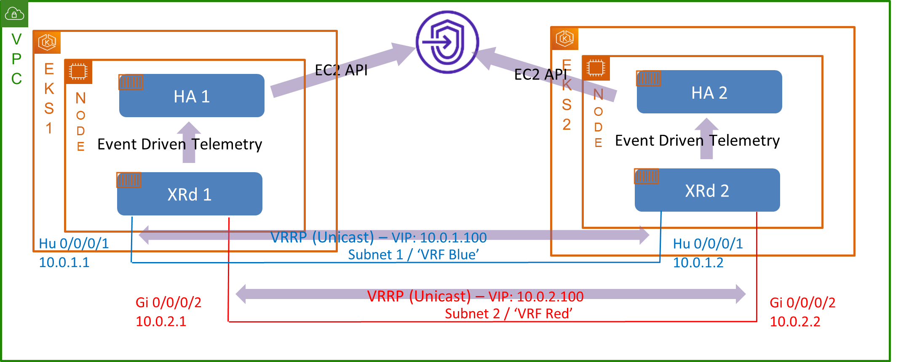

# Functional Specification

This document describes the Cloud HA feature for XRd vRouters running in a public cloud, that is an alternative to HSRP/VRRP which do not work in these environments.

The most important sections are as follows:
* *Problem Definition*: Why standard FHRPs cannot solve the problem, a high level view of the approach taken by the solution, and other considerations which need to be addressed.
* *Software Architecture*: Identifies the main components in the solution, and provides some more detail on how they work within the Cloud Environment.
* *Software Functional Requirements*: Enumeration of the individual capabilities to be provided as part of the solution, including calling out non-requirements.
* *End User Interface/User Experience*: Details of how to configure and monitor/observe the solution.
* *Configuration and Software Restrictions*: Any limitations due to the approach taken (e.g. VRRP features which cannot be supported in the environment).

A notable aspect of the solution is that it requires development of a separate 'microservice' container (the code contained in this repo).
The container is provided as an example for users to modify according to their own bespoke needs, and is made open source without being formally supported by Cisco.


## Problem Definition

XRd vRouter instances may be used in AWS (Amazon Web Services) to act as a Cloud Gateway.
On one side of the gateway, we have the 'hosts' (in this case CNFs) and on the other side we have the 'transport network' (an L3VPN overload over the cloud provider's network).

High Availability is achieved via pairwise router redundancy and is relied on for scheduled maintenance events such as router upgrades as well as unexpected failures.

For traffic flowing from the wider network to the CNFs this is typically sufficient, and routing can identify the active router (or ECMP load balance between the active and standby).

But when a CNF sends traffic to the network it relies on its default route which points to a single gateway IP, but in turn this IP can only be associated with one of the routers (the 'active' member of the pair).

The standard solution to this problem is to use a FHRP (First Hop Routing Protocol) - VRRP is the standards-based solution; HSRP is the older Cisco proprietary protocol. An FHRP introduces the concept of a VIP (Virtual IP, that is an IP address which can move between the two routers depending on the protocol exchange to establish which one is active).

The problem is that these FHRPs do not work in AWS's network (and some other public cloud networks, e.g., Azure).
The reason is that these networks do not support Layer 2 multicast or broadcast which breaks the FHRP in two ways:
* The FHRPs use L2 multicast to send their hellos and negotiate which router is active.
* When a router becomes active, it sends a gratuitous ARP broadcast to notify the rest of the network that traffic to that IP should be sent to its MAC address.

These problems can be solved as follows:
* Use a redundancy protocol and mechanism which does not rely on L2 multicast or broadcast (e.g., spoiler, implement an L3 unicast mode in FHRP).
* Call AWS APIs to add the VIP as a secondary IP on the relevant interface when the router becomes active.

The discussion above covers the primary use case - implementing a 'VIP' for the workloads behind the gateway on AWS - but the general problem expands in two dimensions:
* Supporting other cloud vendors, which may have similar limitations.
* Additional use cases, e.g. in one case there is a requirement to update a separate routing gateway when the router becomes active.
  * The cloud routing gateway only supports a single static route to the destination at a time.
  * Other users may also have their own bespoke actions to perform when the router becomes active.

In general, there is a wide space of potential cases with the following implications:
* It is impractical to code each use case and cloud combination into the XR image.
* It does not make sense to force users to wait for Cisco to implement any new combination identified.

It follows that some abstraction is needed to allow users to implement their own logic.
At the same time, the solution must be easy for users to deploy and operate, keeping in mind that the team running the transport network and virtual routers may not always be familiar with cloud technologies such as Kubernetes and prefer to work from an 'XR CLI'.
A balance is needed, and whilst there is no avoiding the need to package and operationalize separate logic, the solution must minimize and mitigate the impact of this.


## Software Architecture

The solution is based around the following architectural principles:
* Use VRRP to determine active/standby status.
  * Build on 'standard solution' - inheriting its feature set (now and future), robustness (now and ongoing verification).
  * Implement unicast transport to handle AWS multicast limitations.
  * Prefer over HSRP as VRRP is standards driven rather than proprietary.
* Separate the 'HA Automation Logic' into a separate container to be run as a peer (similar to 'sidecar') container to the XRd instance.
  * Users able to change at their cadence.
  * XR image doesn't include customer-specific capabilities.
  * This container is paired 1:1 with each XRd router and affined to same machine as the router.
  * Create an open source example of this container which follows best practice and makes it easy for users to modify to satisfy their own requirements (both required logic and timelines for any changes).

Note that the above design is a cloud-native way to implement third party applications which interact with XRd.
XR's 'AppMgr' is inappropriate in this case because it requires use of nested containers and unnecessarily introduces a new container management paradigm on the user (where Kubernetes is already used).

The solution is illustrated in the following diagram:



This diagram is specific to AWS and shows the primary use case where VIPs are promoted when a router becomes active.
Similar diagrams can be drawn for other use cases (both other cloud environments and/or the action required).

It highlights the following:
* A pair of XRd instances (XRd1 and XRd2) are running in active/standby mode.
  Each is paired with an HA automation container instance (HA1, HA2) running on the same EC2 instance.
  * The container deployment is like a 'sidecar' design where both the router and HA containers run in the same pod.
    However, separate pods are used.
    This is to allow the HA automation logic to be changed without requiring a restart to the router (it is not possible to update a single container in a pod without restarting all the containers in that pod).
  * The XRd instances are shown in different EKS (Elastic Kubernetes Service) clusters, but this detail is not important.
* Two separate subnets ('Red' and 'Blue') are attached to the active/standby router pair, and XRd runs a VRRP session for each subnet, over that subnet, to provide separate protection.
  * A VRRP unicast transport mode is implemented to allow VRRP to run over the cloud provider's network.
    This requires explicit configuration of the router's peer.
* Event-driven Telemetry is used to notify the HA container.
  * This is not a polling mechanism; the telemetry update is sent as soon as the change is detected.
  * The IP connectivity between the XRd and HA container relies on Kubernetes networking which introduces some challenges to the design - see below.
* The HA Automation container invokes the required Cloud environment APIs to react when the router becomes active.
  * In this case the VIP is attached as a secondary IP to the required AWS ENI (Enhanced Networking Interface).
    * This API has an option to override any existing assignment - no need to explicitly remove from the old standby first!
  * The ENI is identified via ENI ID.
    Whilst this is dynamic property which only exists once the interface is created; it can be identified via a mapping between the XR interface name and the attachment index of the interface to the EC2 instance which are both static properties.
    * Alternatively tags or any other suitable mechanism can be used.
    * Furthermore, language specific bindings (e.g., 'boto' for Python) hide the need to do this mapping from the client.
  * The details of the current EC2 instance (including, but not limited to the EC2 ID from which everything else can be retrieved) can be obtained by using the EC2 Metadata service.
    * <https://docs.aws.amazon.com/AWSEC2/latest/UserGuide/ec2-instance-metadata.html>
  * The AWS security credentials required to invoke the AWS APIs are issued using IAM Roles for Service Accounts (IRSA).
    * <https://docs.aws.amazon.com/eks/latest/userguide/iam-roles-for-service-accounts.html>
    * Note that IRSA cannot be used with local clusters for EKS on AWS Outposts.
  * The diagram illustrates the use of a private AWS API endpoint.
    This can be reached without relying on connectivity beyond the VPC (Virtual Private Cloud) and at a lower latency than reaching the public endpoint.
* Deployment is simplified via the creation of a single helm chart to deploy the XRd-HA container pair and any supplementary Kubernetes objects (e.g., services to allow the containers to communicate).


### Networking Considerations

The proposed design relies on IP communication between XRd and the HA automation container via Kubernetes standard networking.

There are three primary areas to consider:
* How can XR telemetry make use of the network connectivity provisioned by Kubernetes?
* Kubernetes Addressing - Services and DNS.
* Choice of Telemetry service.

#### How can XR telemetry make use of the network connectivity provisioned by Kubernetes?

The assumptions that XR makes on how interfaces are consumed, and especially in the way in which they are used by linux applications, conflict with the techniques used by Kubernetes to setup its default networking and so there is work to address this requirement.

Some of the relevant points on XR networking are:
* XR assumes it owns the interface and provides its own, user-space stack for sending/receiving packets on that interface (vs. relying on the Linux kernel).
* XR requires the IP address used to be configured on the relevant interface.
* Linux integration is achieved by creating a special Linux NNS (Network Namespace) for each XR VRF and creating a virtual Linux (kernel) TAP interface to represent each XR interface where the other side of the TAP is connected in to the XR user-space stack.

Some of the relevant points regarding Kubernetes default networking (including some specifics regarding AWS's CNI implementation):
* Kubernetes adds a single 'eth0' interface to the pod's default NNS.
  The interface and NNS is pre-configured as required for connectivity, including the following:
  * IP address and subnet configuration.
    * For the AWS CNI this is a `/32` address.
  * Route table configuration to setup default/gateway route, typically another IP on the same subnet as the pod IP.
    * For the AWS CNI this is a route to a link local address via eth0.
    * A manual ARP entry is installed to resolve the IP.
  * Inject a version of `/etc/resolv.conf` into the container to configure DNS.
    * `/etc/hosts` and `/etc/hostname` are also injected.
* The IP used is dynamically allocated and not predictable.

The proposed solution allows the linux interface to be used but does not provide an XR control plane representation of it.
Hence Linux-based applications (such as gRPC which is used for telemetry) can connect to the Kubernetes network but XR in general cannot.

This is achieved by identifying (via XR configuration) an XR VRF name which uses the default network namespace rather than creating a special one.
This VRF is just used for the telemetry connectivity to avoid leakage or other connectivity complications.

#### Kubernetes Addressing - Services and DNS

To use Telemetry either the HA automation container needs to address the XRd instance (dial-in) or the XRd instance needs to address the HA automation container (dial-out).

If the containers were in the same pod then this would be straightforward as 'localhost' could be used, but they are not.

Kubernetes does not assign persistent IPs so it is not possible to configure the destination IP.
This is deliberate as Kubernetes does not expect any individual pod to communicate directly with another, and instead introduces the concept of a Service, where under the covers the service may be implemented by a pool of pods.
The Service itself usually has a separate 'virtual' IP (actually in a different CIDR to the pods).
In this case the IP can be static, but that is not the default and further static allocation requires careful management of the Service IP CIDR.
Kubernetes really expects DNS to be used to resolve the service name to a suitable IP.
Moreover once a Service has been created, a DNS entry is also created for the pod's IP making it possible to directly address the pod.

Key takeaways:
* A Service must be created (for each HA,XRd pair) to allow them to communicate.
* Kubernetes expects DNS to be used to refer to the destination via a hostname and map it to a IP.
* Once a Service has been defined, it is possible to fix its IP (the Cluster IP) which could allow a solution which doesn't rely on DNS.

References:
* <https://kubernetes.io/docs/concepts/services-networking/service/>
* <https://kubernetes.io/docs/concepts/services-networking/dns-pod-service/>

#### Choice of Telemetry Service

Telemetry is implemented using dial-out Telemetry over a gRPC transport with a self-describing GPB encoding.

*Choice of gRPC transport:*

The solution used to bring the Kubernetes networking into XR pushes us to a Linux native transport, i.e. gRPC, as opposed to raw UDP or TCP which run over the XR stack.

Note: UDP or TCP could be made to work but complicate the networking considerations without obviously having any benefits.

*Choice of dial-out Telemetry:*

Dial-in over gNMI is the preferred approach as it is expected to become the 'standard' way to implement technology.

There is however a limitation in that incoming gRPC connections can only be received in a single VRF and so is incompatible with the need to maintain VRF separation on the telemetry traffic and at the same time use gRPC for other reasons.

Dial-out telemetry is used as it does not have this limitation (the VRF can be specified per destination-group).

*Choice of self-describing GPB encoding:*

This encoding is chosen because it's the most standard option and best supported in the wider ecosystem.

*Other telemetry considerations:*

* When the Telemetry Service connects to the dial-out collector it should send the current value of any event driven item (i.e. an item without a periodic publishing interval).


### Deliverables

Aside from any changes required in the XR image itself, the following are provided as part of the solution:
* Example container implementing two use-cases, production quality, conforming to best practices.
* Helm Chart to combine XRd with HA automation container.
* Resources to allow users to successfully modify and use the end-to-end solution.

The container and Helm chart are provided as part of this repository, and the AWS EKS resources are provided in <https://github.com/ios-xr/xrd-eks>.


## Software Functional Requirements

### Target Platforms

The feature is supported with the XRd vRouter platform only.
Technically the feature could be enabled for use with XRd Control Plane, but this is not an expected deployment scenario, and as such the feature is only enabled for XRd vRouter.


### Cloud Environments

The target environment is AWS, but it is expected that other Cloud Environments will be used in the future.
For the first release the example HA Automation container only demonstrates AWS, but is structured in a way to make it easy to adapt to other environments.

Examples of other environments may be added in the future, or may be implemented by individual users as required.


### Example HA Automation Container and Helm chart

These resources are provided with 'production quality' even though they are open sourced 'as-is' and not supported by Cisco.

Requirements on the container:
* Ability to interact with a private AWS API endpoint.
* Demonstrate use of boto3 Python package, including accommodating private APIs (which are made available via custom JSON profiles).
* Demonstrate two use cases - VIP management on the relevant interfaces and update of a remote routing table.
* Structured to allow for adaptation to other cloud environments
  * Note: The detailed specification for the container will define exactly what this means.
    It does not necessarily mean including a cloud environment abstraction layer if that is artificial and complicates the code and is not viewed as the right way to bring the solution to other environments.
* Any other useful configuration values as informed by the detailed specification of the container itself.

Requirements on the Helm chart:
* Helm chart to encapsulate the combination of the XRd pod and the HA Automation pod (and any ancillary Kubernetes objects such as the Service) as a single release.
* A possible future requirement is to handle a pair of XRd routers and their HA containers as a single Helm chart.
  The design of the Helm chart should be sympathetic to this evolution if possible.

General adherence to 'best practice' for microservice design:
* Production quality logging and observability.
* Consideration of maintaining the Security Posture, including but not limited to:
  * Choice of the base container image.
  * Vulnerability testing to confirm no known security issues in base container.

Future requirements:
* In the future the open source example may be enhanced to support other Cloud Environments.


### Scale and Performance

The following solution level scale and performance metrics are requirements:
* Ability to protect up to 8 separate sessions.
* Invoke the AWS API within 400ms of the fault happening.
  * It has been determined that BFD timers up to a minimum of 100ms can be supported, and therefore BFD down detection is 300ms.
  * Initial testing of the feature has confirmed that the delay between fault detection and invocation of the AWS API is ~33ms, at the full scale of 8 separate sessions.
  * Therefore 400ms is the recommended requirement to provide some buffer (and in most cases comfortably beat the absolute requirement).


## Memory and Performance Impact

Note: This feature is normally run in environments which have a lot of spare compute capacity, certainly relative to any additional resources required by the feature.

For example, the AWS EC2 instances used are `m5.24xlarge`, which have 48 CPU cores and 384 GiB of RAM available, despite only running XRd, the base OS, and Kubernetes.

The following dimensioning is assumed:
* XRd resource allocation of 12 CPU cores (4 control plane, 8 dataplane) and 16 GiB of RAM.
* At least two CPU cores are reserved for the host OS and Kubernetes.
  Today's AWS setup makes 36 cores available.


### XRd

There is no significant impact to memory consumption or other performance of XRd besides the (inevitable) overheads of running VRRP - the base resource allocation is unchanged.


### HA Automation Container

The HA automation container requires minimal resources compared to the dimensioning of the host machine and can share memory and CPU resources with the provisioning for the host OS and Kubernetes.

Testing is performed to confirm that the container can reliably process the telemetry event despite any load on the host OS.


## End User Interface/User Experience

### Example XR Config

An example XR set of XR config is given below, including the telemetry configuration required to connect out to the HA app.

```
vrf ha-vrf
linux networking
 linux-owned-vrf ha-vrf
!
interface HundredGigE0/0/0/0
 ipv4 address 10.0.10.10/24
!
interface HundredGigE0/0/0/1
 ipv4 address 10.0.11.10/24
!
interface HundredGigE0/0/0/2
 ipv4 address 10.0.12.10/24
!
interface HundredGigE0/0/0/3
 ipv4 address 10.0.100.10/24
!
router static
 address-family ipv4 unicast
  10.0.13.0/24 10.0.12.1
  0.0.0.0/0 10.0.100.1
 !
!
router vrrp
 interface HundredGigE0/0/0/0
  address-family ipv4
   vrrp 1
    address 10.0.10.20
    unicast-peer 10.0.10.11
    priority 200
   !
  !
 !
 interface HundredGigE0/0/0/1
  address-family ipv4
   vrrp 2
    address 10.0.11.20
    unicast-peer 10.0.11.11
    priority 200
   !
  !
 !
 interface HundredGigE0/0/0/2
  address-family ipv4
   vrrp 3
    address 10.0.12.20
    unicast-peer 10.0.12.11
    priority 200
   !
  !
 !
!
telemetry model-driven
 destination-group ha-app
  vrf ha-vrf
  destination 172.20.171.1 port 50051
   encoding self-describing-gpb
   protocol grpc no-tls
  !
 !
 sensor-group ha-app
  sensor-path Cisco-IOS-XR-ipv4-vrrp-oper:vrrp/ipv4/virtual-routers/virtual-router
 !
 subscription ha-app
  sensor-group-id ha-app sample-interval 0
  destination-id ha-app
 !
!
```

Note the following:
* A special 'Linux-owned' VRF is configured for the telemetry communications.
* Telemetry encoding and protocol must match that shown (self-describing GPB using gRPC and no TLS, as discussed in [Choice of Telemetry Service](#choice-of-telemetry-service)).
* A sample-interval of zero configures event-driven telemetry notifications.
  * This includes initial messages on reconnection.
* The intended VRRP sensor path is `Cisco-IOS-XR-ipv4-vrrp-oper:vrrp/ipv4/virtual-routers/virtual-router`, as shown.
  * The general path shown above may be replaced with paths that specify VRID/interface name explicitly, e.g. `Cisco-IOS-XR-ipv4-vrrp-oper:vrrp/ipv4/virtual-routers/virtual-router[interface-name="HundredGigE0/0/0/2"][virtual-router-id=2]`.
    However, this is not expected to be necessary since all VRRP sessions are likely to be relevant to the HA container.


### HA Automation Container

This section covers the user interface for the HA automation container that is provided as an example satisfying the initial requirements.
This includes configuration for and interaction with the app itself, and also the expected method for deploying the container alongside the pair of XRd vRouter instances providing redundancy.

#### HA App User Interface

There are two actions initially supported by the HA app, both for use within AWS: 'activate VIP' and 'update route table'.

User configuration for the app is to be provided via a YAML file mounted into the container at the expected path `/etc/ha_app/config.yaml`.
If no file is found at this path, then the container exits at startup with an error messaging explaining what is required.
More details are given in subsection [HA App Configuration File](#ha-app-configuration-file) below.

Details on the container's debuggability (logging output in different scenarios) are given in subsection [HA App Debuggability](#ha-app-debuggability) below.

##### HA App Configuration File

There are two top-level parts to the required configuration: global configuration (e.g. connecting to cloud provider) and actions to be taken when a VRRP subnet becomes active.

Note that only one action is supported per interface/VRID for simplicity and to avoid timing conditions around which action is taken first.

The schema for the YAML configuration file is as follows:

```yaml
# Global configuration.
global:
  # Port number to use for running the gRPC server.
  port: <integer>  # optional, defaults to 50051
  # Interval in seconds at which to perform consistency checks.
  consistency_check_interval_seconds: <integer>  # optional, defaults to 10
  # Only AWS supported initially, other cloud providers may be supported in future.
  aws:
    # URL for a configured AWS VPC endpoint, see https://docs.aws.amazon.com/vpc/latest/privatelink/what-is-privatelink.html.
    ec2_private_endpoint_url: <url>

# List of VRRP groups and action to perform when each goes active.
groups:
    # 'xr_interface' must be a fully qualified, long form XR interface name.
  - xr_interface: <XR interface name>
    # The virtual router ID, as configured in the XR VRRP config.
    vrid: <integer>
    # Action to perform when active state.
    action:
      # 'type' is one of:
      #   aws_activate_vip - move a secondary IP onto the relevant interface.
      #   aws_update_route_table - update route table to point to relevant interface.
      type: <enum>
      # 'device_index' is the AWS interface index, needed for 'aws_activate_vip' only.
      device_index: <integer>
      # 'vip' is the IP address to activate, needed for 'aws_activate_vip' only.
      vip: <IPv4 address>
      # 'route_table_id' is the ID of the route table, needed for 'aws_update_route_table' only.
      route_table_id: <string>
      # 'destination' is the route to update in the route table, needed for 'aws_update_route_table' only.
      destination: <IPv4 address with mask>
      # 'target_network_interface' is the ENI ID to associate the route with, needed for 'aws_update_route_table' only.
      target_network_interface: <string>
```

The following illustrates an example configuration:

```yaml
global:
  port: 50051  # default (optional)
  consistency_check_interval_seconds: 10  # default (optional)
  aws:
    ec2_private_endpoint_url: "https://vpce-0123456789abcdef-vwje496n.ec2.us-west-2.vpce.amazonaws.com"

groups:
  - xr_interface: HundredGigE0/0/0/1
    vrid: 1
    action:
      type: aws_activate_vip
      device_index: 1
      vip: 10.0.2.100
  - xr_interface: HundredGigE0/0/0/2
    vrid: 2
    action:
      type: aws_update_route_table
      route_table_id: rtb-ec081d94
      destination: 192.0.2.0/24
      target_network_interface: eni-90a1bb4e
```

##### HA App Debuggability

The HA app container logs are output to standard error, visible in the container's console logs via e.g. `kubectl logs ha-app`.

The log level is not configurable, always being set to debug - this is because, for simplicity, the logs are not stored in a persistent volume, and the HA app must be debuggable when deployed.
For this reason, the logs must not be too verbose to avoid excessive disk usage or wrapping when managed by Kubernetes.

Example logs in the mainline are as follows, corresponding to the user config example above.
This shows the following flow:
* App startup, reading user config
* Telemetry notification indicating both sessions are inactive
* Telemetry notification indicating both sessions are active, triggering the go-active actions
* Telemetry notification indicating both sessions are still active
* Telemetry connection being lost, active states being reset

```
DEBUG (t= 9)[ha_app.config] - Reading config from file: /etc/ha_app/config.yaml
 INFO (t= 9)[ha_app       ] - Using private EC2 endpoint URL: https://vpce-01c286018e0fad113-vwje496n.ec2.us-west-2.vpce.amazonaws.com
DEBUG (t= 9)[ha_app.aws   ] - Getting session token for IMDSv2
DEBUG (t= 9)[ha_app.aws   ] - Creating AWS EC2 client - instance ID: i-78ec844c4ad6cb354, region: us-east-1
 INFO (t= 9)[ha_app       ] - Registered action 'aws_activate_vip' on <xr_interface=HundredGigE0/0/0/1,vrid=1>
 INFO (t= 9)[ha_app       ] - Registered action 'aws_update_route_table' on <xr_interface=HundredGigE0/0/0/2,vrid=2>
 INFO (t= 9)[ha_app       ] - Host IP addresses: 10.88.0.4
 INFO (t= 9)[ha_app.telem ] - Listening on port 50051...
 INFO (t= 9)[ha_app       ] - Starting consistency checks every 10 seconds
 INFO (t=32)[ha_app.telem ] - Connection established with gRPC peer: 10.88.0.5:41546
DEBUG (t=32)[ha_app       ] - Got INACTIVE for <xr_interface=HundredGigE0/0/0/1,vrid=1>, previously INACTIVE
DEBUG (t=32)[ha_app       ] - Got INACTIVE for <xr_interface=HundredGigE0/0/0/2,vrid=2>, previously INACTIVE
 INFO (t=32)[ha_app       ] - Go active on <xr_interface=HundredGigE0/0/0/1,vrid=1> with aws_activate_vip
 INFO (t=34)[ha_app.aws   ] - Assigning private IPv4 address 10.0.2.100 to device ID 1 (eni-3a10fb97)
 INFO (t=32)[ha_app       ] - Go active on <xr_interface=HundredGigE0/0/0/2,vrid=2> with aws_update_route_table
 INFO (t=35)[ha_app.aws   ] - Updating route table rtb-ec081d94 with destination 192.0.2.0/24, target eni-90a1bb4e
DEBUG (t=32)[ha_app       ] - Got ACTIVE for <xr_interface=HundredGigE0/0/0/1,vrid=1>, previously ACTIVE
DEBUG (t=32)[ha_app       ] - Got ACTIVE for <xr_interface=HundredGigE0/0/0/2,vrid=2>, previously ACTIVE
 INFO (t=32)[ha_app.telem ] - Connection closed by gRPC peer 10.88.0.5:41546
DEBUG (t=32)[ha_app       ] - Marking all VRRP sessions as inactive
```

#### Helm Chart

The Helm chart encapsulates the XRd Pod, HA Automation Pod, and any auxiliary resources as a single release, using the XRd vRouter Helm chart from the public XRd Helm repository as a subchart to define the XRd Pod.

##### Schema

The default values file, which serves as a self-documenting schema for the Helm chart, is available in this repository at [`chart/values.yaml`](/chart/values.yaml).

A schema in JSON Schema format is provided alongside the default values file at [`chart/values.schema.json`](/chart/values.schema.json).
This is used by Helm for validation of user-provided values.

##### Example Values

The user is expected to augment the default values with their own values file when installing or upgrading the Helm chart.
This section provides an example of a user-provided values file, and demonstrates how the user may share values with the XRd vRouter subchart.
This mechanism is described in more detail in [HA App Design: End User Interface](app_design.md#end-user-interface).

```yaml
haApp:
  name: "xrd-ha-app-{{ .Release.Name }}"
  service:
    exposedPort: 50051

xrd:
  config:
    ascii: |
      telemetry model-driven
       destination-group HA-APP
        vrf HA-APP
        destination xrd-ha-app-{{ .Release.Name }}.{{ .Release.Namespace }}.svc.cluster.local port 50051
       !
      !
```


## Configuration and Software Restrictions

### Kubernetes Network Connectivity

The lack of network visibility in IOS XR for the Linux default network namespace means that connectivity will be restricted solely to model-driven telemetry associated with this use case.

In particular:
* IOS XR control plane applications are not expected to have external connectivity in the Linux-owned VRF.
* Applications using the Linux networking infrastructure, will not have external connectivity in the Linux-owned VRF.
  These include:
  * SSH
  * Model-driven telemetry via in-band or management interfaces
  * Install from remote repositories
  * Linux applications using IOS XR's hosted bash shell
* Configuration and operational state which would normally be synchronized between IOS XR and Linux will not be synchronized for the Linux-owned VRF, including:
  * XR interfaces
  * XR IP addresses
  * DNS configuration

### AWS VPC Restrictions

Gratuitous ARP (GARP) is not supported in AWS VPC.

This has a notable impact on the Cloud HA solution: GARP is required in order to meet the performance requirements describe in the Software Functional Requirements section; if the 'host' CNF is not informed that the virtual IP address has moved from Primary to Secondary, then its VIP-address-to-MAC-address mapping is invalid, and traffic will reconverge only when the relevant entry is removed from its ARP cache.

The default ARP cache timeout for Linux-based hosts is a value between 15 and 45 seconds , whereas the default ARP cache timeout in IOS XR is 4 hours.  Neither of these is acceptable to achieve the required performance characteristics.

Amazon’s recommendation is to configure the ARP cache timeout on the host to be as low as possible.


## Testing Considerations

The overall test strategy (unit test, integration test, development test, system integration test) is outside the scope of this document.
See [Test Plan](test_plan.md) for the full plan.

Some specific points are noted below.


### Performance Testing

Testing is required to profile the outage interval when an HA event happens and confirm that requirements are met:
* Testing should verify that the delay between detection and invocation of the AWS APIs is within the required budget (i.e. 400ms - max detection time).
  This testing should include scenarios where the host OS is stressed.
* The testing should quantify the delay introduced by the AWS service (out of our control).


### Vulnerability Testing

The HA Automation Container is run through a container scanner, automated to run periodically.
An example of a suitable tool is <https://github.com/aquasecurity/trivy-action>.
